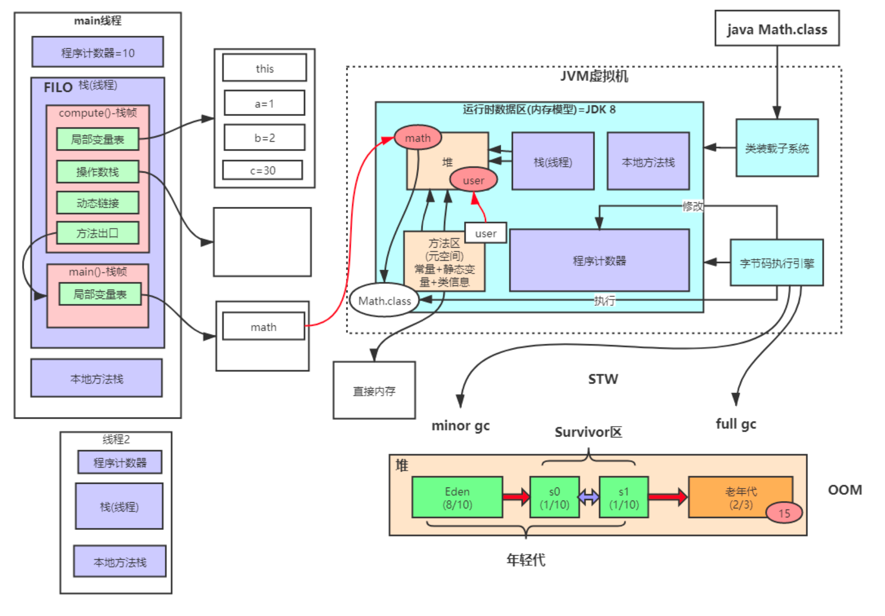
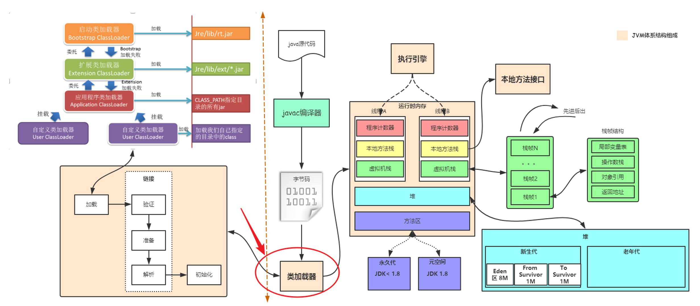

alias:: Java虚拟机

- 内存模型
  collapsed:: true
	- {:height 318, :width 445}
	- 运行时数据区
		- 程序计数器
			- 保存的是当前线程执行的进度
			- 执行引擎通过程序计数器进行线程切换和恢复
		- 本地方法栈
		- 栈/虚拟机栈
			- 栈帧
				- 每个方法被调用的时候，会创建一个栈帧，并入栈。一旦完成相应的调用，则出栈。所有栈帧出栈后，线程也随之结束
				- 每个栈帧包含
					- 局部变量表
					- 操作数栈
					- 动态连接
					- 返回地址/方法出口
		- 堆
			- 垃圾回收、操作的对象都是堆中的e数据
			- 堆中的数据是共享的，是占用内存最大的一块区域
		- 方法区/元空间
			- 常量池
			- 静态常量
			- 类信息
			- 运行时常量池
			- 方法数据
			- 方法代码
	- 字节码执行引擎
	- 类装载子系统 ((65709345-70bf-4b72-975a-ce2ed65ddd5e))
- 类加载
  id:: 65709345-70bf-4b72-975a-ce2ed65ddd5e
	- 
	- 类加载过程
	  collapsed:: true
		- 加载
		  collapsed:: true
			- 加载外部`.class`文件，加载到Java方法区内
		- 验证
		  collapsed:: true
			- 确保文件的字节流包含的信息符合当前虚拟机的要求，保证不会危害虚拟机的安全。
			- 验证方式有
			  collapsed:: true
				- 文件格式验证
				  collapsed:: true
					- 主要是保证Class文件符合Java信息的要求，如：文件类型、版本号、常量池、常量池数据等
					- 这一步字节流会进入内存的方法区中，后面的操作都是基于方法区内的存储结构进行的
				- 元数据验证
				  collapsed:: true
					- 对字节码描述信息进行语义分析，如：是否有父类、重载是否正确
					- 主要目的是对类的元数据进行语义分析，保证符合Java语言规范
				- 字节码验证
				  collapsed:: true
					- 对数据流和控制流进行分析。如：字节码指令集的正确，程序跳转的安全
					- 主要目的是检查方法体内的数据安全，确保程序语义合法，符合逻辑
				- 符号引用验证
				  collapsed:: true
					- 是一个比较特殊的阶段，主要为解析阶段服务，在解析过程中，虚拟机将符号引用转换为直接引用，主要是对常量池中的各种符号引用做匹配行校验
					- 主要校验
					  collapsed:: true
						- 符号引用指向的类能否找到
						- 指定的类有没有描述的方法和字段
						- 符号引用指向的各种信息的访问权限是不是对的
		- 准备
		  collapsed:: true
			- 为类变量（被static修饰的变量）分配内存并设置类变量的初始值，这里的初始值是指赋默认值，如数字默认0，boolean默认false。
			- 但特殊情况下，如：类变量是一个常量则直接设置为对应的常量值
		- 解析
			- 虚拟机将常量池的符号引用直接替换为直接引用的过程
				- 符号引用：能够无歧义定位目标的任何形式的字面量，和虚拟机实现的内存布局无关，引用的目标不一定要加载到内存中
				- 直接引用：可以直接目标指针，偏移量的引用，和虚拟机实现的内存布局相关，引用的目标一定要在内存中
			- 类和接口的解析
			- 字段解析
			- 类方法解析
			- 接口方法解析
			- 方法类型解析
			- 方法句柄解析
			- 调用点解析
		- 初始化
		  collapsed:: true
			- 整个阶段就是执行 `<clinit>()`方法的过程
			- `<clinit>()`中的方法是**编译器**自动收集所有类变量的赋值动作和静态语句块`static{}`块并按顺序合并生成的
			- 虚拟机必须开始初始化的情况
				- 遇到 `new`（生成对象）、`getstatic`、`putstatic`（使用静态变量）、`invoke static`(调用静态方法)这4条指令时
				- 使用`java.lang.reflect`包的方法对类进行反射调用。如果类没有初始化，需要触发初始化
				- 初始化一个类，如果父类还没有初始化，则先初始化父类（父接口不会立即初始化，只有使用到常量时，才需要初始化）
				- 虚拟机启动时的主类会先初始化
				- 动态方法解析，解析出方法是其他类的静态方法，那么需要将其初始化
				- `MethodHandle`和`VarHandle`可以看作是轻量级的反射调用机制，而要使用这两个调用，甩开先试用 `findStaticVarHandle`来初始化要调用的类
				- 当一个接口定义了默认方法（被`default`修饰的方法）时，如果这个接口的实现类发生了初始化，那么该接口要在其之前被初始化
			- 被动调用：看起来需要初始化，但不需要初始化
				- 子类直接使用父类的静态变量。虚拟机规定只有直接定义静态变量的类需要初始化，因此这种情况下，只会触发父类的初始化，子类并不会触发
				- 数组对象。当定对象数组时，只会触发数组类的初始化，其内的对象类并不会初始化
				- 当一个类调用另一个类的常量时。此时并不会对常量类（被调用者）进行初始化，只会将调用者初始化。因为在编译阶段，根据**常量传播优化**，会将常量类的常量放到调用者的常量池中，这时候两个类没有关系了
			- `<clinit>()`方法的执行规则
				- `<clinit>()`方法是由编译器自动收集类中的所有类变量的赋值动作和静态语句块中的语句合并产生的
				- `<clinit>()`方法不需要显式调用父类构造器，虚拟机会保证在子类的`<clinit>()`方法执行之前，父类的`<clinit>()`方法已经执行完毕。因此在虚拟机中第一个被执行的`<clinit>()`方法的类肯定是`java.lang.Object`
				- `<clinit>()`方法对于类或接口来说并不是必须的
				- 接口中不能使用静态语句块，但仍然有类变量`final static`初始化的赋值操作，因此接口与类一样会生成`<clinit>()`方法
				- 虚拟机会保证一个类的`<clinit>()`方法在多线程环境中被正确的加锁和同步
	- 类加载器
	  collapsed:: true
		- Bootstrap ClassLoader
			- 加载核心类库,也就是`rt.jar`、`resources.jar`、`charsets.jar`等
			- 可以通过 `-Xbootclasspath` 指定加载目录
		- Extension ClassLoader
			- 扩展类加载器，用于加载`lib/ext`目录下的 jar 和`.class`文件
			- 通过设置系统变量 `java.ext.dirs` 指定加载目录
			- 继承自 `URLClassLoader`
		- App-ClassLoader
			- alias::  SystemClassLoader
			- 默认加载器，一般加载 `classpath` 下的其他所有jar包和`.class`文件
		- Custom ClassLoader
			- 自定义加载器
	- 双亲委派
	  collapsed:: true
		-
- 垃圾收集器
	- Serial收集器
		- 年轻代垃圾收集器
		- 只有一个线程处理GC，并且在垃圾回收的过程中暂停一切用户线程
		- 使用的资源少，也更轻量级
	- ParNew收集器
		- 年轻代垃圾收集器
		- 是 Serial 的多线程版本
	- Parallel Scavenge收集器
		- 年轻代垃圾收集器
		- 和 ParNew 的区别是
			- Parallel Scaveng： 追求CPU吞吐量
	- Serial Old收集器
	- CMS收集器
	- Garbage First收集器
	- Shenandoah收集器
	- ZGC收集器
	- Epsilon收集器
- 引用级别
	- 强引用
	- 软引用
	- 弱引用
	- 虚引用
- 判断对象存活方式
	- 引用计数算法
	- 可达性分析算法
- GC Roots
	- 包括
		- Java线程中，当前所有正在被调用的方法的引用类型参数、局部变量、临时值等。也就是栈帧相关的各种引用
		- 所有当前被加载的Java类
		- Java类所引用类型静态变量
		- 运行时常量池里的引用类型常量（String或Class类型）
		- 用于同步的监控对象，比如调用了对象的 `wait()` 方法
		- JNI handles，包括 global handles 和 local handles
- 垃圾回收算法
	- 标记清除算法
		- 分为标记和清除两个阶段，首先通过可达性分析找到要回收的对象，对其进行标记，然后再对改对象进行清除
		- 标记：从根集合出发，将所有活动对象及其对象打上标记
		- 清除：遍历堆，将非活动对象的连接到空闲表上
	- 复制算法
	- 标记整理算法
	- 分代收集算法