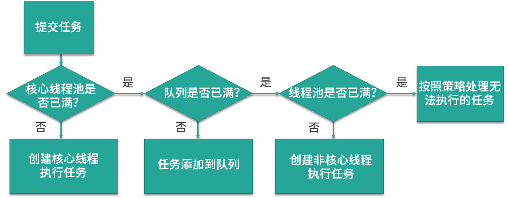

- 线程池
	- 参数
		- | 参数名          | 参数含义               |
		  | --------------- | ---------------------- |
		  | corePoolSize    | 核心线程数             |
		  | maxinumPoolSize | 最大线程数             |
		  | keepAliveTime   | 空闲线程存活时间       |
		  | unit            | 存活时间的单位         |
		  | workQueue       | 存放线程任务队列       |
		  | threadFactory   | 线程工厂，创建新线程   |
		  | handler         | 线程池拒绝处理后的任务 |
		- `corePoolSize`：代表核心线程数，也就是正常情况下创建工作的线程数，这些线程在创建后不会消除，是一种常驻线程
		- `maxiumPoolSize`：代表最大线程数，和与核心线程数对应，表示最大允许被创建的线程数，当核心线程都被用完了还无法满足需求时，就会创建新的线程，但是线程池内线程总数不会超过最大线程数
		- `keepAliveTime`、`unit`：表示超出核心线程数之外的线程的空间存活时间，也就是核心线程不会消除，但是超出核心线程数的部分线程如果空闲一定的时间则会被消除，我们可以通过`setKeepAliveTime`来设置空闲时间
		- `workQueue`：是塞了存放待执行的任务，假设我们现在核心线程都已被使用，还有任务进来则全部放入队列，直到整个队列被放满但任务还持续进入则会开始创建新的线程
		- `threadFactory`：线程工厂，用来生产线程执行任务。可以选择使用默认的创建工厂，产生的线程都在同一个组内，拥有相同的优先级，且都不是守护线程。也可以自定义线程工厂
		- `handler`：任务拒接策略，有两种情况，第一种是调用`shutdown`等方法关闭线程池后，这时候即使线程池内不还有没执行完的任务正在执行，但是由于线程池已经关闭，所以在继续向线程池提交任务也会遭到拒绝。第二种是当达到最大线程数，线程池已经没有能力继续处理新提交的任务时也会拒绝
	- 线程池创建时机
		- {:height 260, :width 645}
	- 拒绝策略
		- `AbortPolicy`：在拒绝任务时，会直接抛出一个类型为`RejectedExecutionException`的`RuntimeException`
		- `DiscardPolicy`：当新任务被提交后直接被丢弃掉，也不会有任务通知，可能会丢失数据
		- `DiscardOldestPolicy`：如果线程池没有被关闭且没有能力执行，则会丢弃任务队列中的头节点，通常是存活时间最长的任务，这种策略与`DiscardPolicy`不同的是丢弃的不是最新提交的，而是队列中存活时间最长的，这样就可以腾出空间给新提交的任务，可能也会丢失数据
		- `CallerRunsPolicy`：当有新的任务后，如果线程池没有被关闭且没有能力执行，则把这个任务交给提交任务的线程执行，也就是谁提交任务，谁就负责执行任务。好处有：
			- 新提交的任务不会被丢弃，也就不会造成业务损失
			- 由于谁提交任务谁就要负责执行任务，这样提交任务的线程就的负责执行任务，而执行任务又是比较耗时的，在这段期间，提交任务的线程被占用，也就不会在提交新的任务，缓减了任务提交的速度
	- 线程池分类
		- `FixedThreadPool`：核心线程数和最大线程数是一样的，所以可以看作是固定线程数的线程池
			- 只有在初始化的时候线程数会从0开始创建，但是创建好后就不在销毁，而是全作为常驻线程池
			- 实现代码 `Executors#newFixedThreadPool(int)`中，如下：
				- ```java
				  public static ExecutorService newFixedThreadPool(int nThreads) {
				      return new ThreadPoolExecutor(nThreads, nThreads,
				                                    0L, TimeUnit.MILLISECONDS,
				                                    new LinkedBlockingQueue<Runnable>());
				  }
				  ```
		- `CachedThreadPool`：常驻核心线程数为0，所有的线程都是临时创建
			- 最大线程为`Integer.MAX_VALUE`，意味着线程数几乎可以无限增加
			- 因为线程都是临时线程，所以都会被销毁，这里的空闲线程销毁时间是 60秒，就是当60秒内没有任务执行
			- 实现代码`Executors#newCachedThreadPool()`中，如下：
				- ```java
				  public static ExecutorService newCachedThreadPool() {
				      return new ThreadPoolExecutor(0, Integer.MAX_VALUE,
				                                    60L, TimeUnit.SECONDS,
				                                    new SynchronousQueue<Runnable>());
				  }
				  
				  public static ExecutorService newCachedThreadPool(ThreadFactory threadFactory) {
				      return new ThreadPoolExecutor(0, Integer.MAX_VALUE,
				                                    60L, TimeUnit.SECONDS,
				                                    new SynchronousQueue<Runnable>(),
				                                    threadFactory);
				  }
				  ```
		- `ScheduledThreadPool`：
		- `SingleThreadExecutor`：核心线程数和最大线程数均为1，不管任务多少，只会有唯一的一个线程去执行
			- 如果线程在执行过程中发生了异常，线程池会重新创建一个线程来执行后续的任务
			- 非常适合所有任务都需要按被提交的顺序来执行的场景，是个单线程的串行
			- 实现代码`Executors#newSingleThreadExecutor()`中，如下：
				- ```java
				  public static ExecutorService newSingleThreadExecutor() {
				      return new FinalizableDelegatedExecutorService
				          (new ThreadPoolExecutor(1, 1,
				                                  0L, TimeUnit.MILLISECONDS,
				                                  new LinkedBlockingQueue<Runnable>()));
				  }
				  
				  public static ExecutorService newSingleThreadExecutor(ThreadFactory threadFactory) {
				      return new FinalizableDelegatedExecutorService
				          (new ThreadPoolExecutor(1, 1,
				                                  0L, TimeUnit.MILLISECONDS,
				                                  new LinkedBlockingQueue<Runnable>(),
				                                  threadFactory));
				  }
				  ```
		- `SingleThreadScheduledExecutor`：
		- `ForkJoinPool`：
	- 底层实现
		- ThreadPoolExecutor
	- 线程池状态