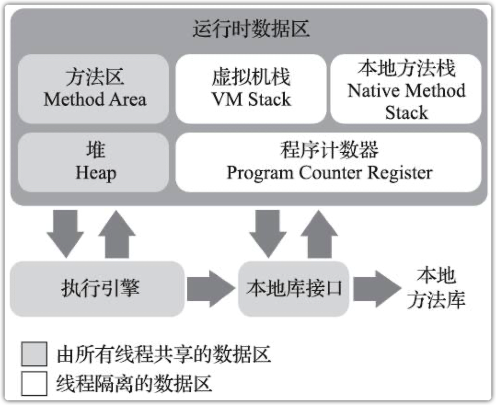
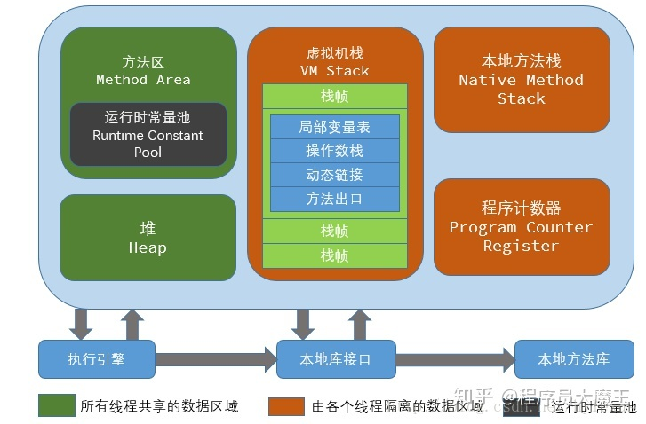

public:: true

- Java虚拟机结构
	- 数据类型
	  collapsed:: true
		- 原始类型
			- 也叫
			  collapsed:: true
				- 基本类型
				- 原生类型
			- 分类
				- 数值类型
					- 整数类型
					  collapsed:: true
						- byte类型
							- 值为8位有符号二进制补码整数，默认值为0
							- 取值范围 -128(-2^7) ~ 127(2^7-1)，包括 -128和127
						- short类型
							- 值为16位有符号二进制补码证书，默认为0
							- 取值范围 -32768(-2^15) ~ 23767(2^15-1)，包括 -32768 和 32767
						- int类型
							- 值为32位有符号二进制补码证书，默认为0
							- 取值范围 -2147483648(-2^31) ~ 2147483647(2^31-1)，包括这两个值
						- long类型
							- 值为64位有符号二进制补码证书，默认为0
							- 取值范围 -2^63 ~ 2^63-1，包括这两个值
						- char类型
							- 值为使用16位无符号整数表示的、指向基本多文种平面(Basic Multilingual Plane,BMP)的Unicode码点，以UTF-16编码，默认值为Unicode的null码点('\u0000')
							- 取值范围 0 ~ 65535
					- 浮点类型
						- float类型
							- 值为单精度浮点数集合中的元素，或者是单精度扩展指数(float-extended-exponent)集合中的元素，默认值为正数0
						- double类型
							- 值为双精度浮点数集合中的元素，或者是双精度扩展指数(double-extended-exponent)集合中的元素，默认值为正数0
				- boolean类型
					- 值为true和false，默认值为false
					- 在编译之后使用int数据类型代替，会把 1表示 true，0表示false
				- returnAddress类型
					- 名存实亡(所对应的指令`jsr`、`ret`、`jsr_w`禁止使用)
					- 指向某个操作码（opcode）的指针，此操作码与Java虚拟机指令相对应
					- 在虚拟机支持的所有原始类型中，只有 returnAddress类型是不能直接与Java语言的数据类型相对应
		- 引用类型
		  collapsed:: true
			- 类类型(class type)
			  collapsed:: true
				- 动态创建的类实例
			- 数组类型(array type)
			  collapsed:: true
				- 数组实例
				- 组建类型
					- 数组类型最外面那一维元素的类型
					- 一个数组的组件类型也可以是数组
					- 例如
					  collapsed:: true
						- int[][][] 的组件类型为 int[][]
				- 元素类型
					- 从任意一个数组开始，如果发现其组件类型也是数组类型，那就继续取这个小数组的组件类型，不断执行这样的操作，最终一定可以遇到组件类型不是数组的情况这就是本书组类型的元素类型
					- 数组的元素类型必须是原生类型、类类型或者接口类型
			- 接口类型(interface type)
			  collapsed:: true
				- 实现了某个接口的类实例或数组实例
	- 运行时数据区
		-   
		  id:: 6408544e-af27-4505-9727-4ede8c1ab16d
		- pc寄存器
		  collapsed:: true
			- 也叫
			  collapsed:: true
				- 程序计数器
		- 虚拟机栈
		  collapsed:: true
			- 每个线程都有自己私有的Java虚拟机栈，这个栈和线程同时创建，用于存储栈帧
			- 可以在堆[^heap]中分配
			- 所使用的内存不需要保证是连续的
			- {{embed ((6406f3f8-732a-4b9f-a82b-002e920b0a93))}}
		- 本地方法栈
			- 异常情况
			  id:: 6406f3f8-732a-4b9f-a82b-002e920b0a93
			  collapsed:: true
				- 如果线程请求分配的栈容量超过本地方法栈允许的最大容量，JVM将会抛出一个 `StackOverflowError` 异常
				  id:: 6406f400-3b15-4ade-b9bc-bca717f7fb29
				- 如果本地方法栈可以动态扩展，并且在尝试扩展时无法申请到足够的内存或这在创建新的线程时没有足够的内存去创建对应的本地方法栈，那么JVM将会抛出一个 `OutOfMemoryError` 异常
				  id:: 6406f43b-4db5-4de2-9e78-c97104f87632
				-
		- 堆
			- 各个线程共享的运行时内存区域
			- 所有类实例和数组对象分配内存的区域
			- 在虚拟机启动时就被创建
			- 存储了被自动内存管理系统所管理的各种对象，无法显式销毁
			- 当所需的堆超过了自动内存管理系统能提供的最大容量
				- 抛出 `OutOfMemoryError` 异常
		- 方法区
			- 供各个线程共享的运行时内存区域
			- 在虚拟机启动时创建
			- 容量可以时固定的也可以是随着程序执行的需求动态扩展，并在不需要过多空间时自动收缩
			- 在内存中可以是不连续的
			- 存储了每个类的结构信息，如
				- 运行时常量池
					- 是class文件中每一个类或接口的常量池表的运行时表示
				- 字段
				- 方法数据
				- 构造函数
				- 普通方法的字节码内容
				- 类
				- 实例
				- 接口初始化时用到的特殊方法
			- 方法区的内存空间不能满足内存分配请求
				- 抛出`OutOfMemoryError`异常
	- 栈帧
-
- [^heap]: Stack、Heap和Java(VM) Stack、Java Heap是不同的概念，程序分配在Java Stack 中的数据，从实现虚拟机的程序角度看可能是分配在Heap中
-
-
-
-
-
-
-
-
-
-
-
-
-
-