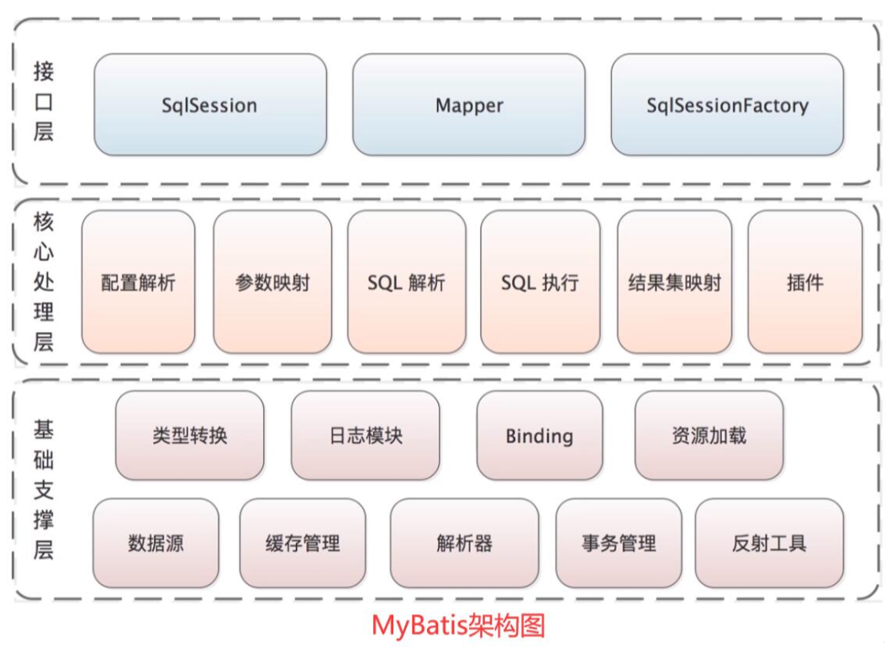
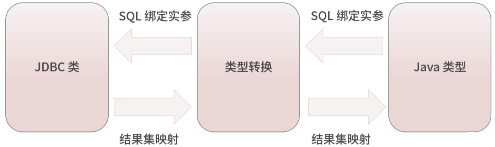
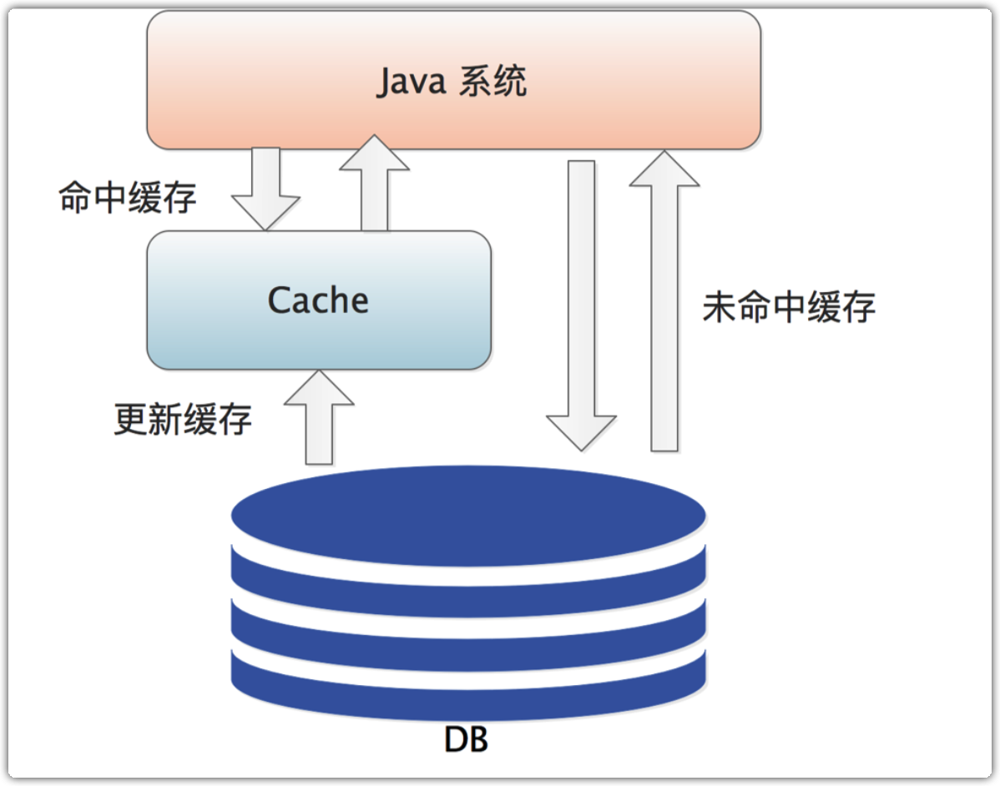

- 架构
	- 
	- 基础支撑层
		- 类型转换模块
			- 
			- 通过配置 `<typeAliase>` 标签为一个类定义一个别名
			- 在 SQL 模板绑定用户传入实参的场景中，模块会将 Java 类型数据转换为 JDBC 类型数据类型
			- 将 ResultSet 映射成结果对象的时候，模块会将 JDBC 类型数据转换为 Java 类型数据
		- 日志模块
			- 用于集成第三方日志框架，可以集成`Log4j`、`Log4j2`、`Slf4j`
		- 反射工具模块
			- 在 Java 反射的基础上进行一层封装，为上层使用方法提供更加灵活、方便的 API 接口，同时缓存 Java 的原生反射相关的元数据，提升了反射代码执行的效率，优化了反射操作的性能
			- 代码位于 `org.apache`
		- Binding 模块
			- 通过 SqlSession 获取 Mapper 接口的代理，通过这个代理执行关联 Mapper.xml 文件中的数据库操作。通过这种方式可以将一些错误提前到编译期
		- 数据源模块
			- 核心组件之一，MyBatis 自身提供了一套数据源的默认实现，也提供了和第三方数据源集成的相关接口
		- 缓存模块
			- 
		- 解析器模块
			- Mybatis 中有两大部分配置文件需要进行解析，一个是`mybatis-config.xml`配置文件，还有一个是`*Mapper.xml`文件。这两个文件都是有解析器模块进行解析的，其中主要是依赖 `XPath` 实现 `xml` 配置文件以及各类表达式的解析
		- 事务管理模块
			- 持久层一般都会提供一套事务管理机制用来实现数据库的事务控制，MyBatis 对数据库中的事务进行了一层简单的抽象，提供了简单易用的事务接口和实现
	- 核心处理层
		- 配置解析
			- 在初始化过程中，会加载这些配置信息，并将解析之后得到的配置对象保存到 Configuration 对象中
		- SQL 解析
			- MyBatis 提供的的标签可根据实际的运行条件动态生成实际执行的 SQL 语句。如`<where>`、`<if>`、`<foreach>`、`<set>`
		- scripting
			- 负责动态生成 SQL 的核心模块。会根据运行时用户传入的实参，解析动态 SQL 中的标签，并形成 SQL 模版，然后处理 SQL 模版中的占位符，用运行时的实参填充占位符，得到数据库真正可执行的 SQL 语句
		- SQL 执行
			- 在 Mybatis 中，要执行一条 SQL 语句，会设计很多的组件，核心的有：`Executor`、`StatementHandler`、`ParameterHandler`和`ResultSetHandler`
			- `Executor` 会调用事务管理模块实现事务的相关控制，同时会通过缓存模块管理一级缓存和二级缓存
			- SQL 语句的真正执行将会由`StatementHandler`实现
				- `StatementHandler` 会先依赖 `ParameterHandler` 进行 SQL 模版的实参绑定，然后由`java.sql.Statement`对象将 SQL 语句以及绑定好的实参传到数据库执行，从数据库中拿到`ResultSet`，最后由`ResultSetHandler`将`ResultSet`映射成 Java 对象返回给调用方
				- 
		- 插件
			- 提供扩展能力，用来改变 MyBatis 的默认行为
	- 接口层
		- 暴露给调用的接口集合，这些接口都是使用 MyBatis 时最长的一些接口，比如：`SqlSession 接口`、`SqlSessionFactory 接口`等，其中可以通过`SqlSession 接口`实现很多功能也是最核心的接口，如：获取 Mapper 代理、执行 SQL 语句、控制事务开关