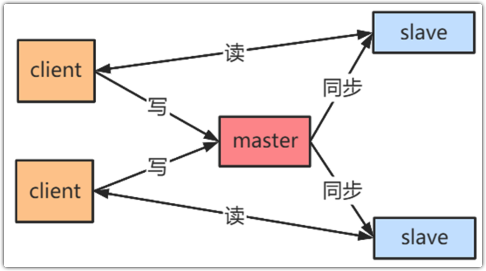
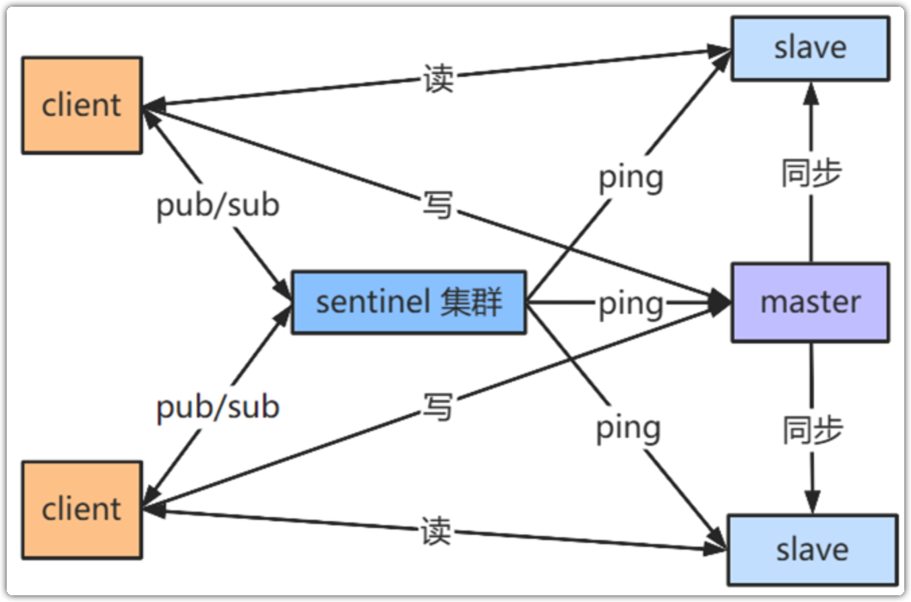
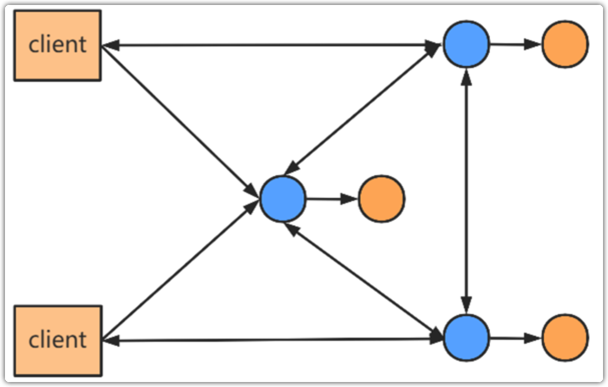

- [[高可用]]
	- 主从模式
	  id:: 64044890-9355-403f-b7b3-bb99754ffeb9
		- 原理
		  collapsed:: true
			- 
			- 客户端同时连接Master节点和Slave节点，写操作通过Master节点执行，并将结果同步给Slave节点，读操作通过Slave节点执行。
		- 优缺点
		  collapsed:: true
			- 部署简单，最少两个节点便可以构成主从模式
			- 通过读写分离避免读和写同时不可用
			- 适合业务发展初期，并发量低，运维成本低的情况
	- 哨兵模式
		- 原理
		  collapsed:: true
			- 
			- 相比 ((64044890-9355-403f-b7b3-bb99754ffeb9)) ，哨兵模式新增了独立部署的节点-哨兵节点（Sentinel）。这些节点不参与数据处理，但会像哨兵一样负责监控Master和Slave的状态以及拓扑关系，并把主从关系信息提供给客户端。客户端在连接的时候，会先选择哨兵节点，获取Master和Slave信息，然后在连接Master和Slave
		- 优缺点
		  collapsed:: true
			- 哨兵模式是官方推荐的高可用模式
			- 适合读请求远多于写请求的业务场景，比如秒杀系统中用来缓存活动信息
	- 集群模式
		- 原理
			- 