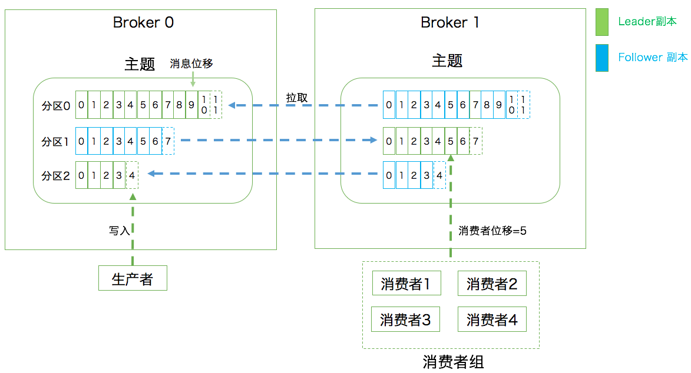

- 名词
	- 消息：Record，kafka处理的主要对象
	- 主题：Topic，承载消息的逻辑容器，在实际使用中用来区分具体的业务
	- 分区：Partition，一个有序不变的消息序列，在每个主题下可以有多个分区
	- 位移：Offset，分区中每条消息的位置信息，是一个单调递增且不变的值
	- 副本：Replica，kafka中同一条消息能够被拷贝到多个地方以提供数据冗余，这些地方就是副本。
		- 副本氛围领导者和追随者副本，各自有不同的角色划分。副本是分区层级下的，即每个分区可配置doge副本实现高可用
	- 生产者：Producer，向主题发布新消息的应用程序
	- 消费者：Consumer，从主题订阅新消息的应用程序
	- 消费者位移：Consumer Offset，消费这消费的进度，每个消费者都有自己的消费者位移
	- 消费者组：Consumer Group，多个消费者实例共同组成一个组，同时消费多个分区已实现高吞吐
	- 重平衡：Rebalance，消费者组内某个消费者实例挂掉后，其他消费者实例自动重新分配订阅主题分区的过程。
		- Rebalance是Kafka消费者段实现高可用的重要手段
	- 