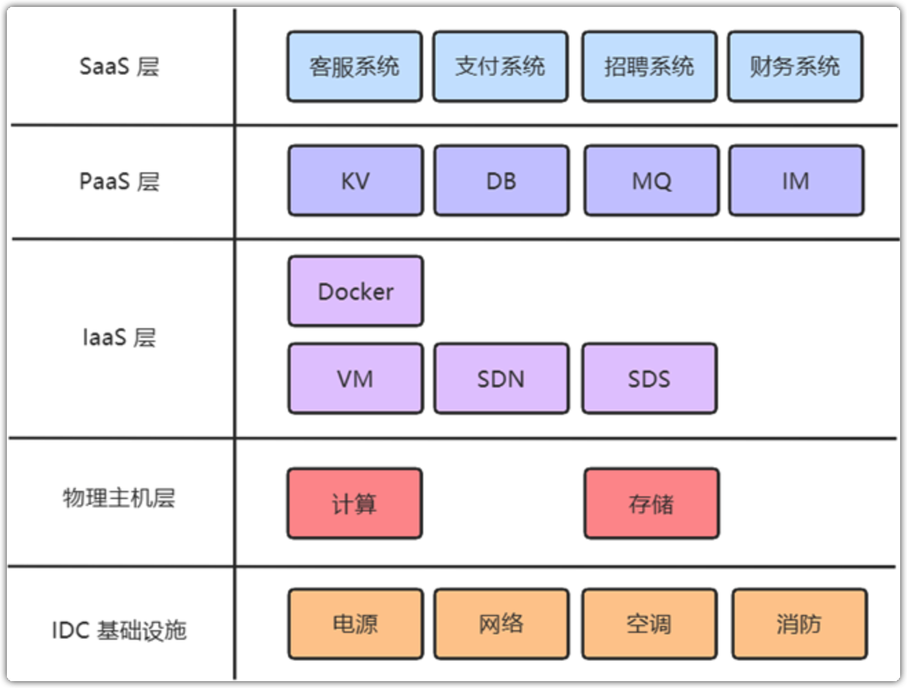

- 分层设计
	- 
	- IDC基础设施层
		- 全称
			- Internet Data Center
			- 互联网数据中心
		- 包括
			- 电源
			- 网络
			- 空调
			- 消防等
		- 电源和网络的高可用
			- 方案
				- 配备多条线路
				- 多机房部署
			- 例如
			  collapsed:: true
				- 同时接入火电网和水电网，并配备UPS和发电机
	- 物理主机层
		- 存储和计算分离
	- IaaS层
		- 全称
			- Infrastructure as a Service
			- 基础设施即服务
		- 概念
			- 通过虚拟化技术在宿主机上虚拟出多个运行环境，应用部署在虚拟出来的运行环境里
		- 常见方案
			- 主机虚拟化
				- 概念
					- 利用软件来虚拟整套计算机硬件，也就是VM（虚拟机）
				- 方案
					- VMware
					- KVM
					- Xen
			- 容器虚拟化
				- 概念
					- 利用Linux命名空间技术，在Linux系统里划分出多个互相隔离的运行环境，可以为每个运行环境单独分配资源
				- 方案
					- docker
	- Paas层
	  collapsed:: true
		- 全称
			- Platform as a Service
			- 平台即服务
	- SaaS层
		- 全称
			- Software as a Service
			- 软件即服务
		- 概念
			- 提供软件的后端，还有软件的前端页面，达到开箱即用的效果