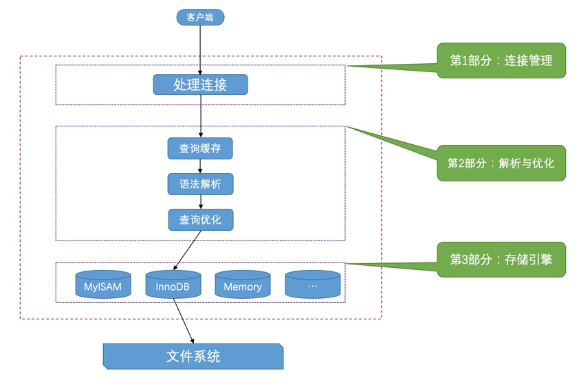

- ## 服务器处理客户端请求
	- 
	- ### 连接管理
		- 服务器端会使用线程池来处理客户端的连接
	- ### 解析与优化
		- #### 查询缓存
		- #### 语法解析
		- #### 查询优化
	- ### 存储引擎
		- 常见存储引擎
			- ARCHIVE
				- 用于数据存储（行被插入后不能在修改）
			- BLACKHOLE
				- 丢弃写操作，读操作会返回空内容
			- CSV
				- 在存储数据是，以逗号分隔各个数据项
			- FEDERATED
				- 用来访问远程表
			- [[InnoDB]]
				- 具备外键支持功能的事物存储引擎
			- MEMORY
				- 置于内存的表
			- MERGE
				- 用来管理多个MyISAM表构成的表集合
			- [[MyISAM]]
				- 主要的非事物处理存储引擎
			- NDB
				- MySQL集群专用存储引擎