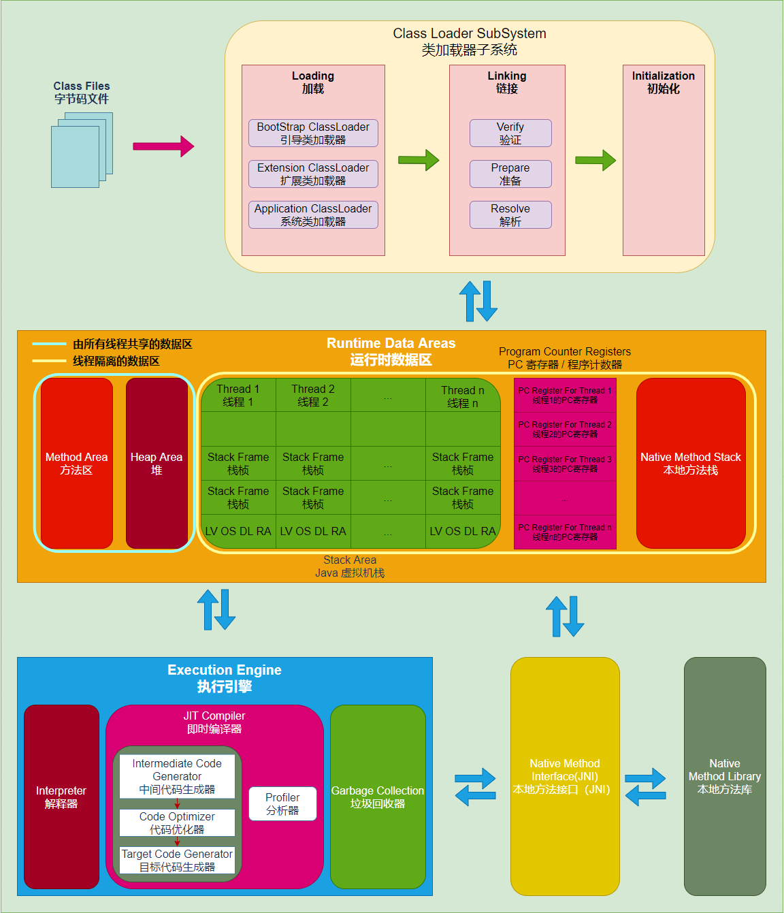
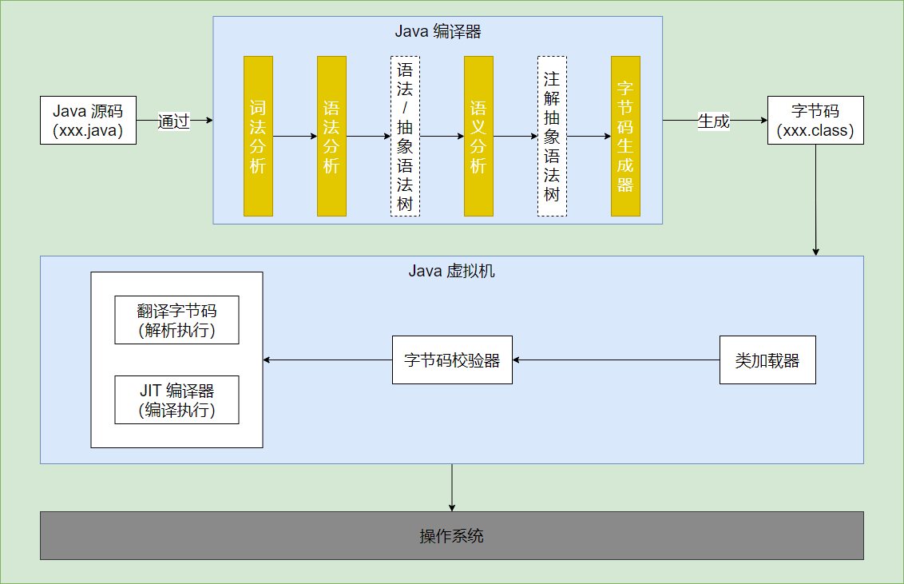

- JVM架构图
  title:: 深入理解Java
  collapsed:: true
	- 
- 代码执行流程
	- 
- [[JVM发展历程]]
- 自动内存管理
	- 运行时数据区
		- 
		- 程序计数器 #线程私有
			- 是一块较小的内存空间，是**当前线程所执行的字节码的行号指示器**
			- 字节码解释器工作时就是通过**改变程序计数器的值来选去下一条需要执行的字节码指令**，是程序控制流的指示器，分支、循环、跳转、异常处理和线程恢复等基础功能都需要依赖这个计数器来完成
			- 线程私有内存
				- Java多线程是通过线程轮流切换、分配处理器执行时间的方式来实现的，所以为了线程切换后可以恢复到正确的执行位置，每个线程都需要有一个独立的程序计数器，各个线程之间的计数器互不影响，独立存储
			- 如果线程在执行Java方法时，那么计数器的值虚拟机字节码指令的地址，如果是本地（Native）方法，那么计数器的值为空（Undefined）
		- 栈
			- Java虚拟机栈  #线程私有
				- Java方法执行的线程内存模型
					- 每个方法被执行的时候，Java虚拟机都会同步创建一个栈帧（Stack Frame）用于存储局部变量表、操作数栈、动态链接、方法出口等信息
					- 每个方法被调用直到执行完毕，就对应着一个栈帧在虚拟机栈中从入栈到出栈的过程
			- 局部变量表
				- 存放了编译期可知的各种Java虚拟机基本数据类型（boolean、byte、char、short、int、float、long、double）、对象引用（reference类型，不等同于对象本身，可能是一个指向对象起始地址的引用指针，也能可能是指向一个代表对象的句柄或者其他与此对象相关的位置）和returnAddress类型（指向了一条字节码指令的地址）
-