- 秒杀活动信息的管理
	- 1. 梳理活动流程
	  2. 梳理接口清单
	  3. 梳理隐藏需求
	  4. 梳理需求分析
	- [[高并发系统]]
	- 秒杀架构
		- [[架构设计方法]]
		  collapsed:: true
			- [[逻辑架构]]
			  collapsed:: true
				- 三层架构
				  collapsed:: true
					- 表现层
					  collapsed:: true
						- 指用户可以通过哪些方式使用系统功能
						- 例如
						  collapsed:: true
							- 电脑web端
							- 手机web端
							- app端
					- 逻辑层
					  collapsed:: true
						- 主要和业务逻辑相关
						- 功能
						  collapsed:: true
							- 前端
							  collapsed:: true
								- 用户登录
								- 查看活动
								- 订阅通知
								- 查看商品
								- 抢购
								- 下单
							- 后台
							  collapsed:: true
								- 专题管理
								- 场次管理
								- 商品管理
								- 库存管理
								- 价格管理
								- 限购管理
					- 数据层
					  collapsed:: true
						- 指系统的业务逻辑需要处理哪些数据
						- 例如
						  collapsed:: true
							- 配置数据
							- 用户数据
				- 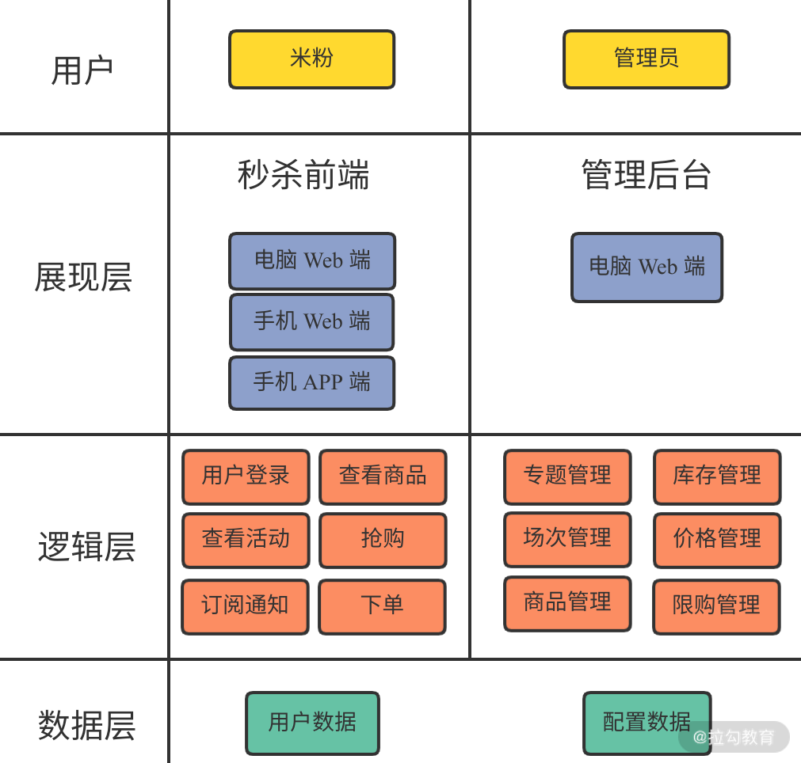
			- [[物理架构]]
			  collapsed:: true
				- 动态接口和静态页面分离
				  collapsed:: true
					- 将静态页面和静态数据利用CDN缓存起来，以便利用CDN的就近访问能力提供更高的性能
					- 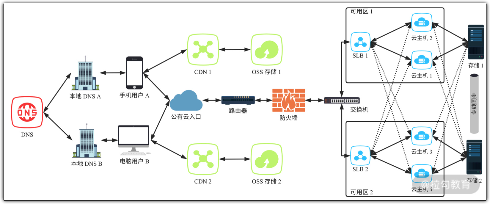
			- [[数据架构]]
			  collapsed:: true
				- 通常使用ER图表示
				- 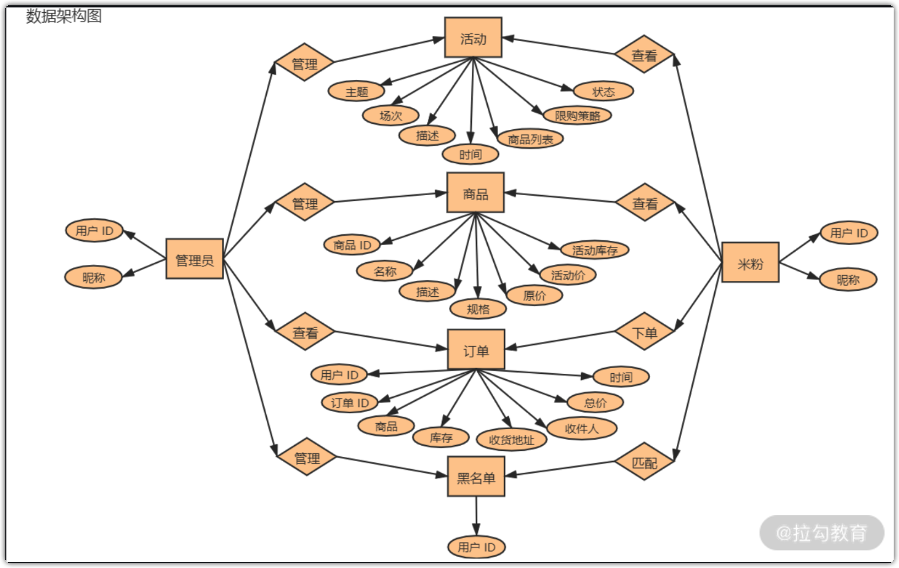
		- [[DDD]]
		  collapsed:: true
			- 战略建模
			  collapsed:: true
				- 从宏观上构建领域模型
				- 例子
				  collapsed:: true
					- 建大楼之前，需要先绘制出大楼的整体外观设计并划分出大楼每个功能区，然后在进行整体结构设计。这些划分出来的功能区，就好比软件系统中的各个子系统和组件
					- 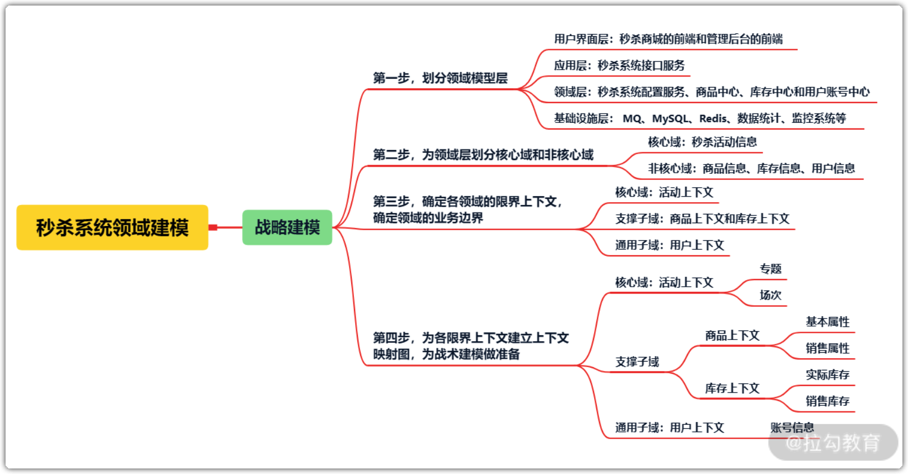
				- 步骤
					- 第一步：确认系统中的各个子系统和组建，可以划分到领域模型的哪一层
					  collapsed:: true
						- 秒杀商城的前端和管理后台的前端，可以划分到用户界面层
						- 秒杀系统接口服务，因为负责给秒杀前端提供活动信息和活动相关商品信息，可以划分到应用层
						- 秒杀系统配置服务、商品中心、库存中心和用户账号中心，因为设计对应核心领域的具体业务逻辑，可以划分到领域层
						- MQ、MySQL、Redis、数据统计、监控系统等，负责提供数据的流转、存储、查询的能力，可以划分到基础设施层
					- 第二步：为领域层划分核心域和非核心域，便于后期设计
					  collapsed:: true
						- 例如
						  collapsed:: true
							- 秒杀系统包括活动信息、商品信息、用户信息、库存信息
							- 核心功能是提供秒杀活动的能力，不管是商城前端还是管理后台页面，交互的涮口都是从活动信息开始的。所以活动信息就是秒杀系统的核心域，而商品信息、库存信息、用户信息是非核心域
						- 为了区分哪些是在系统中通用的，非核心域要区分支撑子域和通用子域
						- 支撑子域
						  collapsed:: true
							- 指跟当前业务有关联的非核心域，并在当前业务系统中起到支撑的作用
							- 例如秒杀系统中的商品信息、库存信息都是为秒杀活动提供支撑作用
						- 通用子域
						  collapsed:: true
							- 指跟当前系统的核心业务逻辑关系不大但又必须要有的非核心域，在所有系统中都通用的
							- 例如秒杀系统中的用户信息等
					- 第三步：确定各个领域的限界上下文，确定领域的业务边界
					  collapsed:: true
						- 主要为了明确系统中各子系统和业务模块的具体职责
						- 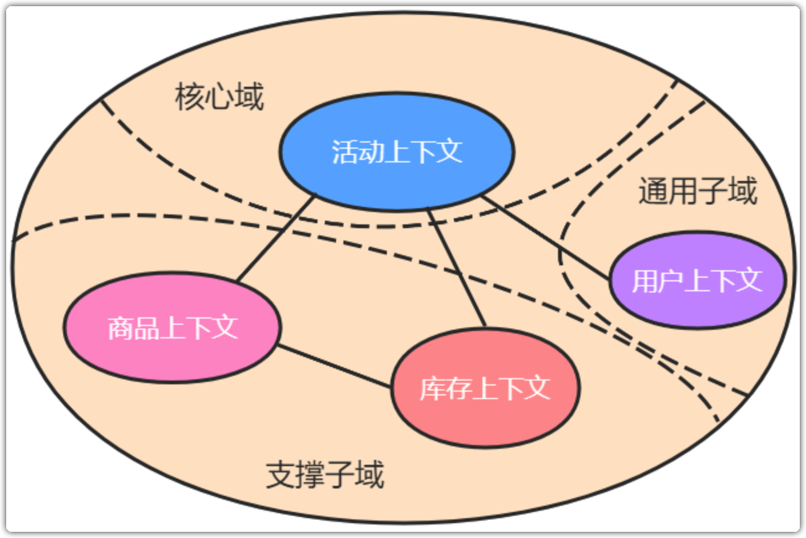
						-
						-
					- 第四步：为各限界上下文建立上下文映射图，为战术建模做准备
						- 核心域的限界上下文就是活动上下文
							- 例子
							  collapsed:: true
								- 活动主题
								- 活动场次等
							- 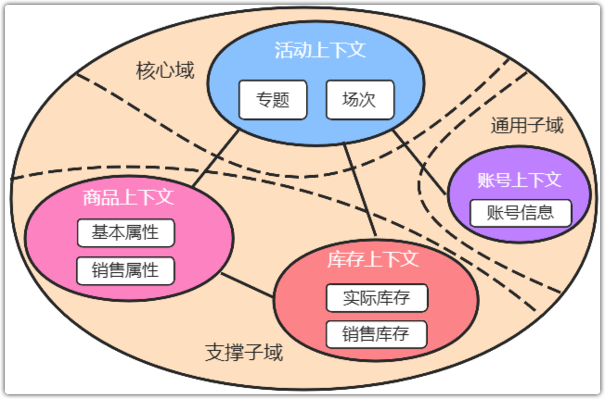
			- 战术建模
				- 概念
					- 从具体细节上构建领域模型，是对战略建模中限界上下文的具体实现
				- 秒杀系统的战术建模就是分析活动领域中各个对象的类型，针对类型特点做抽象设计
					- 在对象中可以通过Id或唯一标识来确定
						- 实体
						  collapsed:: true
							- 能被唯一表示出来的对象
							- 例如
								- 专题
								- 商品
						- 值对象
						  collapsed:: true
							- 不能被唯一标识出来的对象，要么是一个具体的值
							- 例如
								- 实际库存
								- 销售库存
								- 原价
								- 活动价
						- 聚合根
						  collapsed:: true
							- 将其他对象聚合而来
							- 例如
								- 场次
								- 活动商品
						- 领域事件
						  collapsed:: true
							- 可能触发的事件
							- 例如
								- 活动开始和结束
		- 故障转移
		  collapsed:: true
			- 主备切换
				- 主从关系划分
				  collapsed:: true
					- 狭义
						- 有明确的主从角色划分，主节点承担主要的集群管理工作，当主节点故障，从节点变成主节点，接管主节点的工作
						- 适合有状态的系统，也就是有数据存储功能的系统，比如存储系统等
					- 广义
					  collapsed:: true
						- 没有明确的主从角色划分，任何一个节点发生故障，工作就会分配到其他任何一个正常节点上，不需要指定主节点
						- 适合无状态的系统，也就是没有数据存储功能的系统，比如HTTP服务
				- 目的
				  collapsed:: true
					- 保障系统中有可用节点，一旦发现某个节点出现故障，就会自动将故障节点的流量快速转移到其他可用节点上，待故障节点恢复正常后，又自动将其加回到系统中
				- 过程
					- 第一步：故障自动侦测(Auto-detect)
						- 采用健康检查、心跳等技术手段自动侦测故障节点
					- 第二步：自动转移(FailOver)
						- 当侦测到故障节点后，采用摘除流量、脱离集群等方式隔离故障节点，将流量转移到正常节点
					- 第三部：自动恢复(FailBack)
						- 当故障节点恢复正常后，自动将其加入集群中，确保集群资源和故障前一致
				- 方案
					- 存储系统的主备切换
					  collapsed:: true
						- 概念
							- 储存系统是用状态的，因为需要将数据存储到磁盘，确保数据的完整性和一致性
							- 当节点出现故障时，需要立即检测出来并执行主备切换
							- 对于存储系统来说，主备切换依赖节点间的心跳机制来自动侦测节点状态
						- 方案
							- BRDB（Distributed Replicated Block Device，分布式复制块设计）
								- 原理
								  collapsed:: true
									- 将存储节点的磁盘作为块设备，通过互相映射的方式实现互相备份
									- 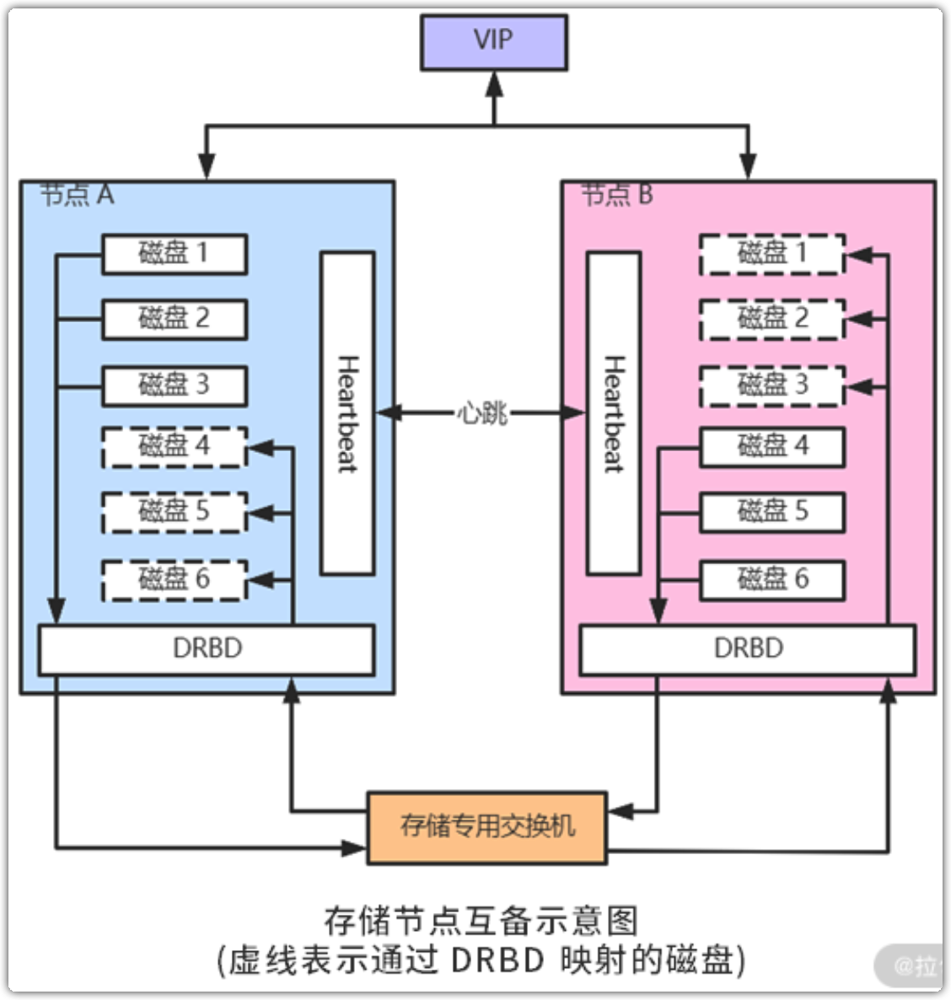
								- 只实现了各个节点间的磁盘互备，各个节点的心跳和主备切换是通过 Heartbeat来实现的
							- Heartbeat
								- 是Linux-HA工程的一个组成部分
								- 原理
								  collapsed:: true
									- 部署在集群内节点上，用于给节点提供心跳机制，各节点通过侦测到其他节点心跳来判断其他节点是否有故障。如果侦测到故障节点，则有正常节点接管故障节点的流量，然后继续侦测故障节点的心跳
									- 还能将主备节点的网卡绑定到一个共同的VIP（Virtual IP，虚拟IP），以便将主备节点作为一个整体对外提供服务
								- 其他产品
							- Keepalived 也能为集群节点提供心跳和主备切换功能
								- 和 Heartbeat 的区别
									- 常用于负载均衡器的主备切换
					- 业务系统的主备切换
						- 方案
							- 通过Nginx、微服务等组件的侦测能力，就可以识别故障节点，并将其摘除，然后选择正常的节点重试出错的请求
					- SLB和DNS的主备切换
						- 方案
							- DDNS
							- HTTPDNS
		- 过载保护
			- 概念
				- 负载超过系统的承载能力时，系统会自动采取保护措施，确保自身不被压垮
			- 方案
				- 熔断
				  collapsed:: true
					- 原理
						- 在系统濒临崩溃的时候，立即中断服务，从而保障系统稳定避免崩溃
				- 限流
				  collapsed:: true
					- 原理
						- 通过判断某个条件来确定是否执行某个策略
					- 目的
						- 确保系统高效、稳定的运行
						- 确保请求能够快速处理的同时，保障系统不被流量压垮
					- 算法
					  collapsed:: true
						- 计数器限流
						  id:: 640443cc-1fc5-43cb-8d13-ca4bd7adbf3b
						  collapsed:: true
							- alias:: 固定窗口限流
							- 原理
								- 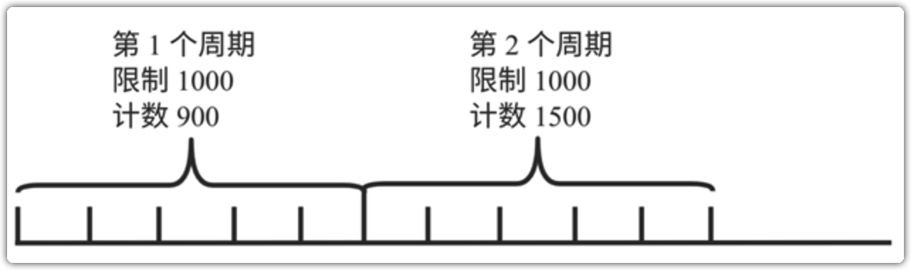
								- 第一步：选定一个时间窗口作为一个周期，假设为5秒
								- 第二步：设定5秒内允许通过的流量，如1000个请求
								- 第三步：每次请求，计数器都加1
								- 第四步：判断计数器数值是否超过1000，超过了就出发限流策略，如：拒绝或者延迟处理请求等
								- 最后：如果时间超过了5秒，则重置计数器为0，开始一个新的周期
							- 优缺点
								- 实现简单
								- 面对出发流量时不够精确
								- 面对瞬时流量时会存在资源利用率的剧烈抖动
						- 滑动窗口限流
						  collapsed:: true
							- 原理
							  collapsed:: true
								- 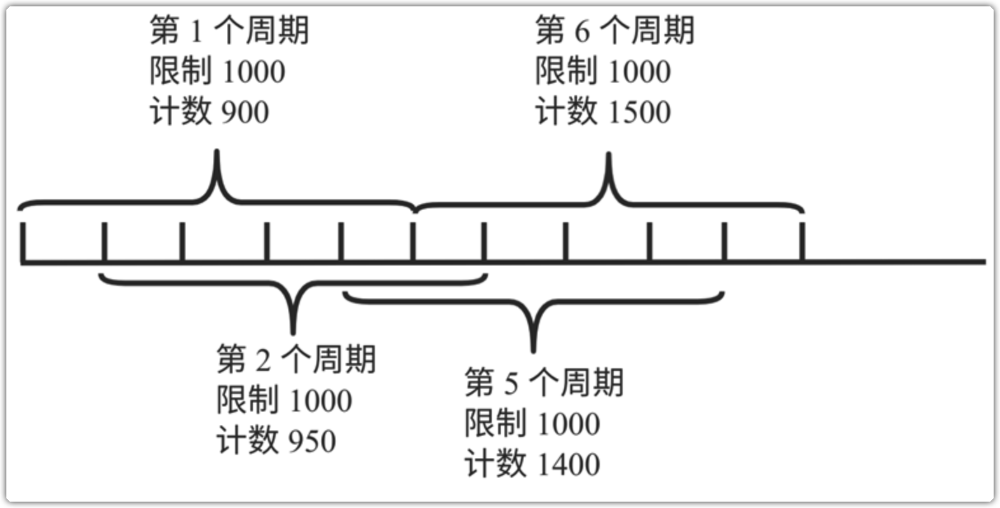
								- 是对 ((640443cc-1fc5-43cb-8d13-ca4bd7adbf3b)) 的优化,主要原理是将计数器限流算法中的一个周期拆分成很多等分，比如将5秒的周期拆分成5个1秒，每次统计当前时间开始过去的5秒内的流量，每隔1秒往后滑动1秒
							- 优缺点
								- 相比 ((640443cc-1fc5-43cb-8d13-ca4bd7adbf3b)) 而言对流量的统计和控制更加精确，资源利用率抖动更小
								- 但是还是没有解决因瞬时流量导致资源使用率抖动的问题
						- 令牌桶限流
						  id:: 640443db-956e-42e7-90ff-491196ceb61d
						  collapsed:: true
							- 原理
								- 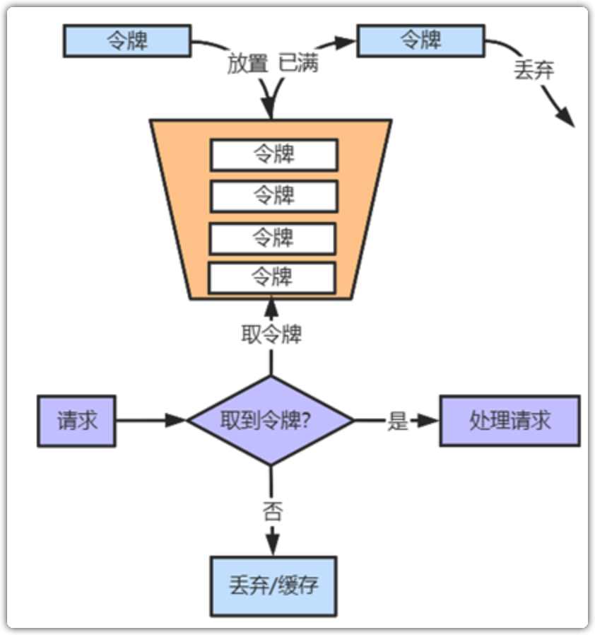
								- 使用一个定时器以恒定速度往桶里办法令牌，桶满则丢弃多余令牌
						- 漏桶限流
						  collapsed:: true
							- 原理
							  collapsed:: true
								- 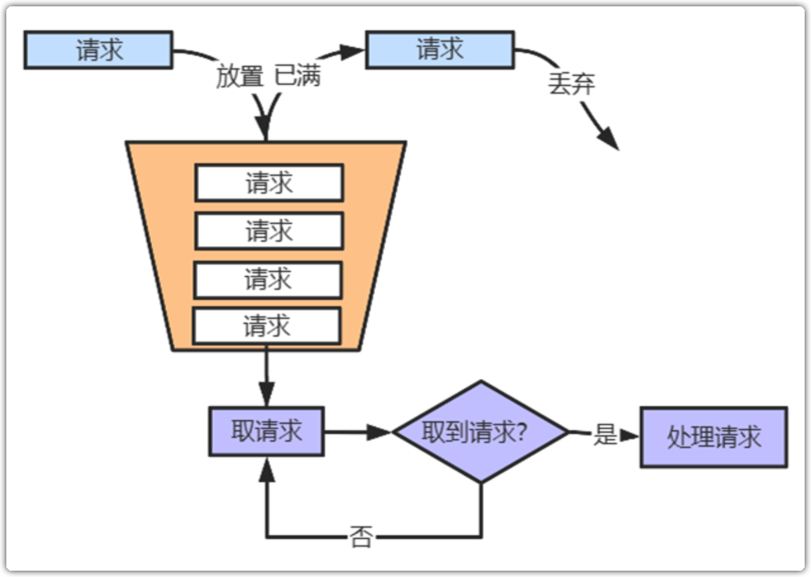
								- 和 ((640443db-956e-42e7-90ff-491196ceb61d)) 类似，只不过漏桶算法采用 “生产者-消费者”模型。在生产者一端，所有请求进队列，队列满了则丢弃请求，在消费者一端，以恒定速度消费队列并处理请求
								-
					- 对比（从好到差)
						- 漏桶限流 > 令牌桶限流 > 滑动窗口限流 > 计数器限流
		-
-