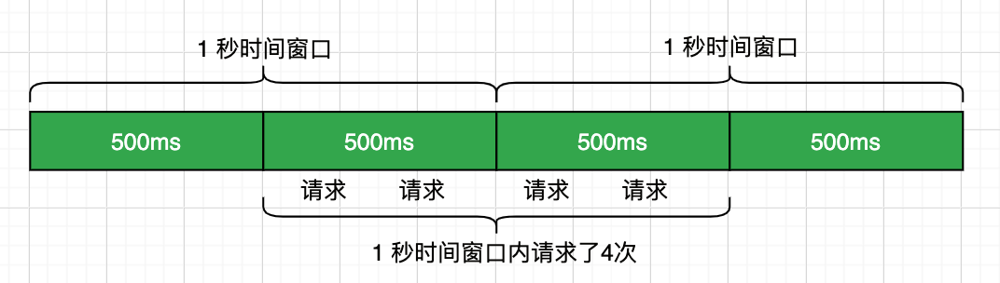
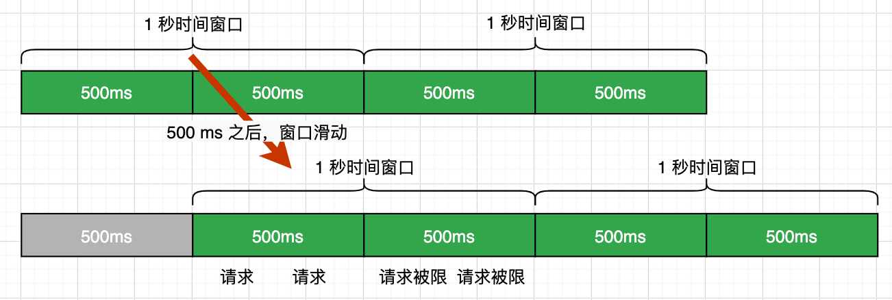

- 当流量超过服务设计时的承载量时，通过一定的算法，将无法处理的流量丢弃，以保证服务的稳定性
- 概念
	- 阈值： 在一个单位时间内允许的请求量，如QPS限制为10，说明1秒内最多接受10次请求
	- 拒绝策略：超过阈值的请求的拒绝策略，常见的拒绝策略有直接拒绝、排队等待等
- 算法
	- 计数器算法/固定窗口算法
		- 常见最容易实现的限流算法
		- 原理： 记录一定时间内的请求数量，将超过阈值的请求拦截掉
		- {:height 77, :width 245}
		- 缺点：在临界区见容易触发错误的限流判定
			- 如：假设设定请求记录时间为1S，限流触发阈值为2，在上一个记录区间的最后100ms和当前记录区间的前100ms都发生了接近阈值的请求量2，但是这样就无法触发限流，但是请求超过了系统的最大负载
		- 实现
			- ```java
			  /**
			   * @author https://www.wdbyte.com
			   */
			  public class RateLimiterSimpleWindow {
			      // 阈值
			      private static Integer QPS = 2;
			      // 时间窗口（毫秒）
			      private static long TIME_WINDOWS = 1000;
			      // 计数器
			      private static AtomicInteger REQ_COUNT = new AtomicInteger();
			      
			      private static long START_TIME = System.currentTimeMillis();
			  
			      public synchronized static boolean tryAcquire() {
			          if ((System.currentTimeMillis() - START_TIME) > TIME_WINDOWS) {
			              REQ_COUNT.set(0);
			              START_TIME = System.currentTimeMillis();
			          }
			          return REQ_COUNT.incrementAndGet() <= QPS;
			      }
			  
			      public static void main(String[] args) throws InterruptedException {
			          for (int i = 0; i < 10; i++) {
			              Thread.sleep(250);
			              LocalTime now = LocalTime.now();
			              if (!tryAcquire()) {
			                  System.out.println(now + " 被限流");
			              } else {
			                  System.out.println(now + " 做点什么");
			              }
			          }
			      }
			  }
			  ```
	- 滑动窗口
		- 是计数器算法的改进，解决了上面的问题
		- 
		- 实现
			- ```java
			  /**
			   * 滑动窗口限流工具类
			   */
			  public class RateLimiterSlidingWindow {
			      /**
			       * 阈值
			       */
			      private int qps = 2;
			      /**
			       * 时间窗口总大小（毫秒）
			       */
			      private long windowSize = 1000;
			      /**
			       * 多少个子窗口
			       */
			      private Integer windowCount = 10;
			      /**
			       * 窗口列表
			       */
			      private WindowInfo[] windowArray = new WindowInfo[windowCount];
			  
			      public RateLimiterSlidingWindow(int qps) {
			          this.qps = qps;
			          long currentTimeMillis = System.currentTimeMillis();
			          for (int i = 0; i < windowArray.length; i++) {
			              windowArray[i] = new WindowInfo(currentTimeMillis, new AtomicInteger(0));
			          }
			      }
			  
			      /**
			       * 1. 计算当前时间窗口
			       * 2. 更新当前窗口计数 & 重置过期窗口计数
			       * 3. 当前 QPS 是否超过限制
			       *
			       * @return
			       */
			      public synchronized boolean tryAcquire() {
			          long currentTimeMillis = System.currentTimeMillis();
			          // 1. 计算当前时间窗口
			          int currentIndex = (int)(currentTimeMillis % windowSize / (windowSize / windowCount));
			          // 2.  更新当前窗口计数 & 重置过期窗口计数
			          int sum = 0;
			          for (int i = 0; i < windowArray.length; i++) {
			              WindowInfo windowInfo = windowArray[i];
			              if ((currentTimeMillis - windowInfo.getTime()) > windowSize) {
			                  windowInfo.getNumber().set(0);
			                  windowInfo.setTime(currentTimeMillis);
			              }
			              if (currentIndex == i && windowInfo.getNumber().get() < qps) {
			                  windowInfo.getNumber().incrementAndGet();
			              }
			              sum = sum + windowInfo.getNumber().get();
			          }
			          // 3. 当前 QPS 是否超过限制
			          return sum <= qps;
			      }
			  
			    	@Data
			    	@AllArgsConstructor
			      private class WindowInfo {
			          // 窗口开始时间
			          private Long time;
			          // 计数器
			          private AtomicInteger number;
			      }
			  }
			  
			  ```
	- 滑动日志算法
		- 记录下所有请求的时间点，新请求到时先判断最近指定时间范围内的请求数量是否超过阈值，由此来确定是否达限流，限流比较准确，但是因为要记录每次请求的时间点，所以占用内存较多
	- 漏桶算法
	- 令牌桶
	-