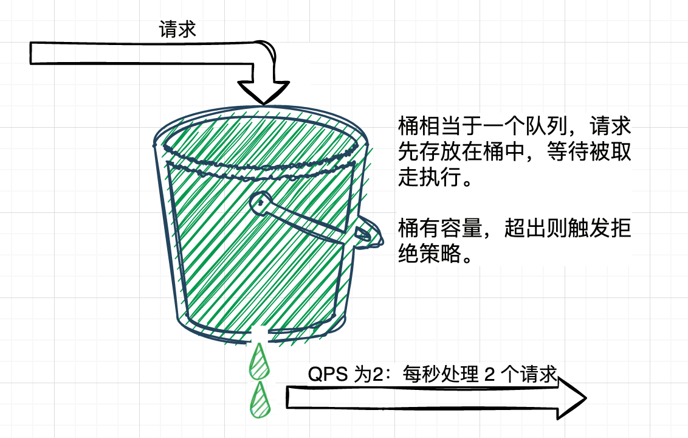
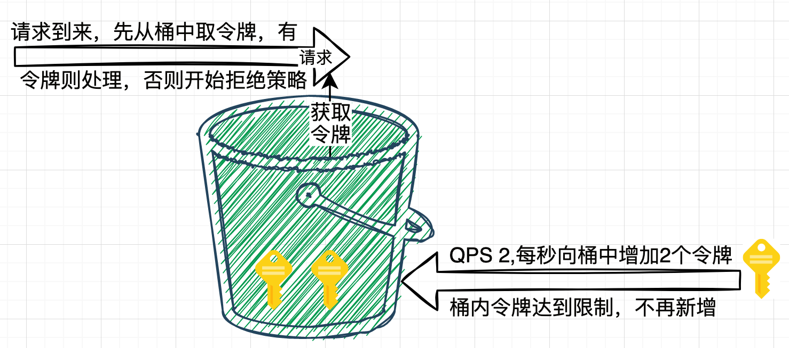

- 当流量超过服务设计时的承载量时，通过一定的算法，将无法处理的流量丢弃，以保证服务的稳定性
- 概念
	- 阈值： 在一个单位时间内允许的请求量，如QPS限制为10，说明1秒内最多接受10次请求
	- 拒绝策略：超过阈值的请求的拒绝策略，常见的拒绝策略有直接拒绝、排队等待等
- 算法
	- 计数器算法/固定窗口算法
		- 常见最容易实现的限流算法
		- 原理： 记录一定时间内的请求数量，将超过阈值的请求拦截掉
		- {:height 77, :width 245}
		- 缺点：在临界区见容易触发错误的限流判定
			- 如：假设设定请求记录时间为1S，限流触发阈值为2，在上一个记录区间的最后100ms和当前记录区间的前100ms都发生了接近阈值的请求量2，但是这样就无法触发限流，但是请求超过了系统的最大负载
		- 实现
			- ```java
			  /**
			   * @author https://www.wdbyte.com
			   */
			  public class RateLimiterSimpleWindow {
			      // 阈值
			      private static Integer QPS = 2;
			      // 时间窗口（毫秒）
			      private static long TIME_WINDOWS = 1000;
			      // 计数器
			      private static AtomicInteger REQ_COUNT = new AtomicInteger();
			      
			      private static long START_TIME = System.currentTimeMillis();
			  
			      public synchronized static boolean tryAcquire() {
			          if ((System.currentTimeMillis() - START_TIME) > TIME_WINDOWS) {
			              REQ_COUNT.set(0);
			              START_TIME = System.currentTimeMillis();
			          }
			          return REQ_COUNT.incrementAndGet() <= QPS;
			      }
			  
			      public static void main(String[] args) throws InterruptedException {
			          for (int i = 0; i < 10; i++) {
			              Thread.sleep(250);
			              LocalTime now = LocalTime.now();
			              if (!tryAcquire()) {
			                  System.out.println(now + " 被限流");
			              } else {
			                  System.out.println(now + " 做点什么");
			              }
			          }
			      }
			  }
			  ```
	- 滑动窗口
		- 是计数器算法的改进，解决了上面的问题
		- 
		- 实现
			- ```java
			  /**
			   * 滑动窗口限流工具类
			   */
			  public class RateLimiterSlidingWindow {
			      /**
			       * 阈值
			       */
			      private int qps = 2;
			      /**
			       * 时间窗口总大小（毫秒）
			       */
			      private long windowSize = 1000;
			      /**
			       * 多少个子窗口
			       */
			      private Integer windowCount = 10;
			      /**
			       * 窗口列表
			       */
			      private WindowInfo[] windowArray = new WindowInfo[windowCount];
			  
			      public RateLimiterSlidingWindow(int qps) {
			          this.qps = qps;
			          long currentTimeMillis = System.currentTimeMillis();
			          for (int i = 0; i < windowArray.length; i++) {
			              windowArray[i] = new WindowInfo(currentTimeMillis, new AtomicInteger(0));
			          }
			      }
			  
			      /**
			       * 1. 计算当前时间窗口
			       * 2. 更新当前窗口计数 & 重置过期窗口计数
			       * 3. 当前 QPS 是否超过限制
			       *
			       * @return
			       */
			      public synchronized boolean tryAcquire() {
			          long currentTimeMillis = System.currentTimeMillis();
			          // 1. 计算当前时间窗口
			          int currentIndex = (int)(currentTimeMillis % windowSize / (windowSize / windowCount));
			          // 2.  更新当前窗口计数 & 重置过期窗口计数
			          int sum = 0;
			          for (int i = 0; i < windowArray.length; i++) {
			              WindowInfo windowInfo = windowArray[i];
			              if ((currentTimeMillis - windowInfo.getTime()) > windowSize) {
			                  windowInfo.getNumber().set(0);
			                  windowInfo.setTime(currentTimeMillis);
			              }
			              if (currentIndex == i && windowInfo.getNumber().get() < qps) {
			                  windowInfo.getNumber().incrementAndGet();
			              }
			              sum = sum + windowInfo.getNumber().get();
			          }
			          // 3. 当前 QPS 是否超过限制
			          return sum <= qps;
			      }
			  
			    	@Data
			    	@AllArgsConstructor
			      private class WindowInfo {
			          // 窗口开始时间
			          private Long time;
			          // 计数器
			          private AtomicInteger number;
			      }
			  }
			  
			  public static void main(String[] args) throws InterruptedException {
			      int qps = 2, count = 20, sleep = 300, success = count * sleep / 1000 * qps;
			      System.out.println(String.format("当前QPS限制为:%d,当前测试次数:%d,间隔:%dms,预计成功次数:%d", qps, count, sleep, success));
			      success = 0;
			      RateLimiterSlidingWindow myRateLimiter = new RateLimiterSlidingWindow(qps);
			      for (int i = 0; i < count; i++) {
			          Thread.sleep(sleep);
			          if (myRateLimiter.tryAcquire()) {
			              success++;
			              if (success % qps == 0) {
			                  System.out.println(LocalTime.now() + ": success, ");
			              } else {
			                  System.out.print(LocalTime.now() + ": success, ");
			              }
			          } else {
			              System.out.println(LocalTime.now() + ": fail");
			          }
			      }
			      System.out.println();
			      System.out.println("实际测试成功次数:" + success);
			  }
			  ```
	- 滑动日志算法
		- 记录下所有请求的时间点，新请求到时先判断最近指定时间范围内的请求数量是否超过阈值，由此来确定是否达限流，限流比较准确，但是因为要记录每次请求的时间点，所以占用内存较多
		- 实现
			- ```java
			  /**
			   * 滑动日志方式限流
			   * 设置 QPS 为 2
			   */
			  public class RateLimiterSildingLog {
			  
			      /**
			       * 阈值
			       */
			      private Integer qps = 2;
			      /**
			       * 记录请求的时间戳,和数量
			       */
			      private TreeMap<Long, Long> treeMap = new TreeMap<>();
			  
			      /**
			       * 清理请求记录间隔, 60 秒
			       */
			      private long claerTime = 60 * 1000;
			  
			      public RateLimiterSildingLog(Integer qps) {
			          this.qps = qps;
			      }
			  
			      public synchronized boolean tryAcquire() {
			          long now = System.currentTimeMillis();
			          // 清理过期的数据老数据，最长 60 秒清理一次
			          if (!treeMap.isEmpty() && (treeMap.firstKey() - now) > claerTime) {
			              Set<Long> keySet = new HashSet<>(treeMap.subMap(0L, now - 1000).keySet());
			              for (Long key : keySet) {
			                  treeMap.remove(key);
			              }
			          }
			          // 计算当前请求次数
			          int sum = 0;
			          for (Long value : treeMap.subMap(now - 1000, now).values()) {
			              sum += value;
			          }
			          // 超过QPS限制，直接返回 false
			          if (sum + 1 > qps) {
			              return false;
			          }
			          // 记录本次请求
			          if (treeMap.containsKey(now)) {
			              treeMap.compute(now, (k, v) -> v + 1);
			          } else {
			              treeMap.put(now, 1L);
			          }
			          return sum <= qps;
			      }
			  
			      public static void main(String[] args) throws InterruptedException {
			          RateLimiterSildingLog rateLimiterSildingLog = new RateLimiterSildingLog(3);
			          for (int i = 0; i < 10; i++) {
			              Thread.sleep(250);
			              LocalTime now = LocalTime.now();
			              if (rateLimiterSildingLog.tryAcquire()) {
			                  System.out.println(now + " 做点什么");
			              } else {
			                  System.out.println(now + " 被限流");
			              }
			          }
			      }
			  }
			  ```
	- 漏桶算法
		- 请求来了后会先进入到桶中，然后以恒定的速率将请求流出进行处理，从而起到平滑流量的作用，可以保护系统不会被突如其来的流量冲垮。当请求的流量过大时，漏桶大到最大容量时会溢出，此时请求被丢弃。
		- 
		  id:: 6582bbb6-abb9-4bf5-9d2f-fbcb7a131ce3
		- ```java
		  public class LeakyBucketLimiter {
		  
		      private int capaticy;//漏斗容量
		      private int rate;//漏斗速率
		      private int left;//剩余容量
		      private LinkedList<Request> requestList;
		  
		      private LeakyBucketLimiter() {}
		  
		      public LeakyBucketLimiter(int capaticy, int rate) {
		          this.capaticy = capaticy;
		          this.rate = rate;
		          this.left = capaticy;
		          requestList = new LinkedList<>();
		  
		          //开启一个定时线程，以固定的速率将漏斗中的请求流出，进行处理
		          new Thread(new Runnable() {
		              @Override
		              public void run() {
		                  while(true){
		                      if(!requestList.isEmpty()){
		                          Request request = requestList.removeFirst();
		                          handleRequest(request);
		                      }
		                      try {
		                          Thread.sleep(1000 / rate); //睡眠
		                      } catch (InterruptedException e) {
		                          e.printStackTrace();
		                      }
		                  }
		              }
		          }).start();
		      }
		  
		      /**
		       * 处理请求
		       * @param request
		       */
		      private void handleRequest(Request request){
		          request.setHandleTime(new Date());
		          System.out.println(request.getCode() + "号请求被处理，请求发起时间："
		                  + request.getLaunchTime() + ",请求处理时间：" + request.getHandleTime() + ",处理耗时："
		                  + (request.getHandleTime().getTime()  - request.getLaunchTime().getTime()) + "ms");
		      }
		  
		      public synchronized boolean tryAcquire(Request request){
		          if(left <= 0){
		              return false;
		          }else{
		              left --;
		              requestList.addLast(request);
		              return true;
		          }
		      }
		  
		      /**
		       * 请求类，属性包含编号字符串、请求达到时间和请求处理时间
		       */
		      @Data
		      @NoArgsConstructor
		      @AllArgsConstructor
		      static class Request{
		          private int code;
		          private Date launchTime;
		          private Date handleTime;
		      }
		  
		      public static void main(String[] args) {
		          LeakyBucketLimiter leakyBucketLimiter = new LeakyBucketLimiter(5,2);
		          for(int i = 1;i <= 10;i ++){
		              Request request = new Request(i,new Date());
		              if(leakyBucketLimiter.tryAcquire(request)){
		                  System.out.println(i + "号请求被接受");
		              }else{
		                  System.out.println(i + "号请求被拒绝");
		              }
		          }
		      }
		  }
		  ```
	- 令牌桶算法
		- 原理
			- 对漏桶算法的一种改进，可以起到限流的作用外，还可以允许一定程度的突发流量。实现思路类似于生产者和消费者之间的关系。
			- 系统服务作为生产者，按照指定频率向桶（容器）中添加令牌，如QPS为2，每500ms向桶中添加一个令牌，如果桶中令牌数量达到阈值，则不在添加。
			- 请求执行作为消费者，每个请求都需要去桶中拿一个令牌，拿到令牌则继续执行，如果桶中没有令牌可取，就会触发拒绝策略，由此达到限流目的。
		- 特点
			- 1s/QPS = 令牌添加时间间隔
			- 桶的容量等于限流阈值，令牌数量达到阈值时，不在添加
			- 可以适应流量突发，
		- 
	-